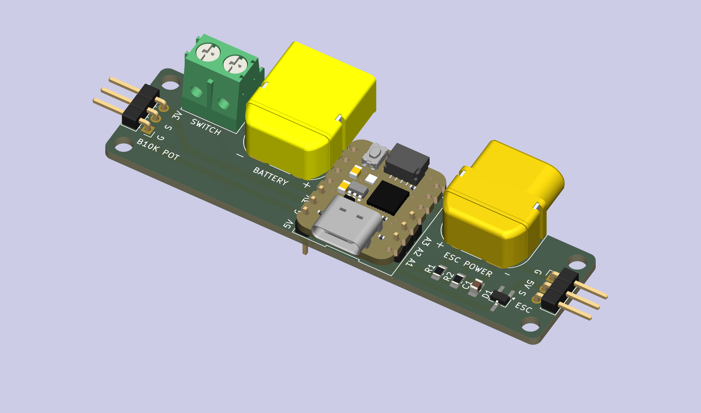
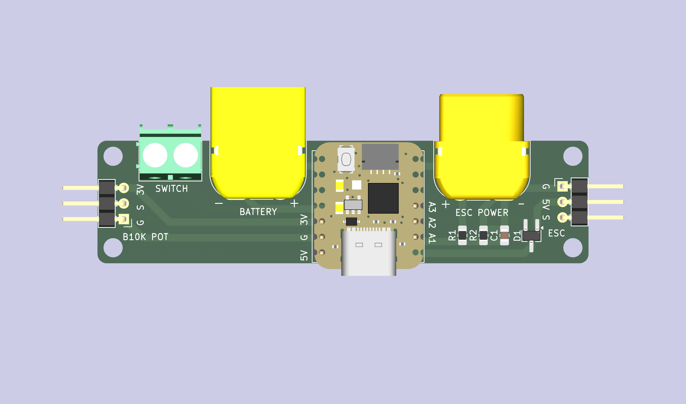
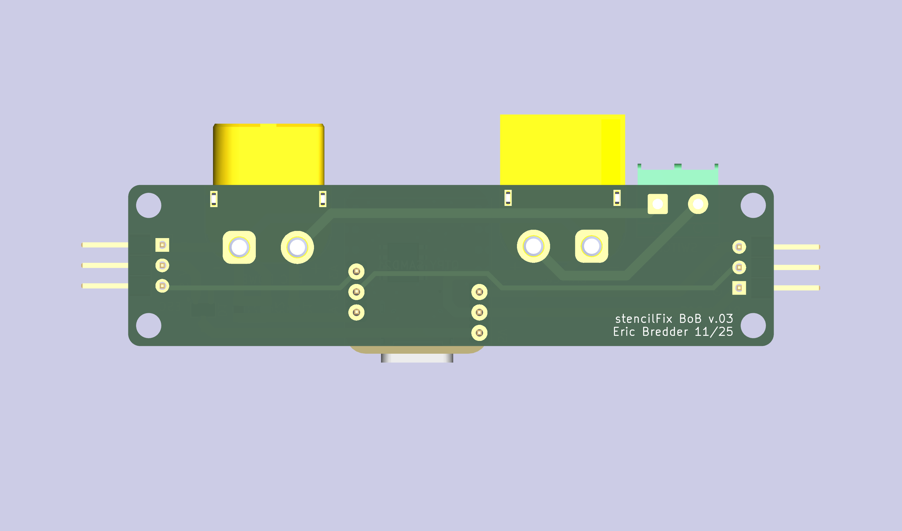
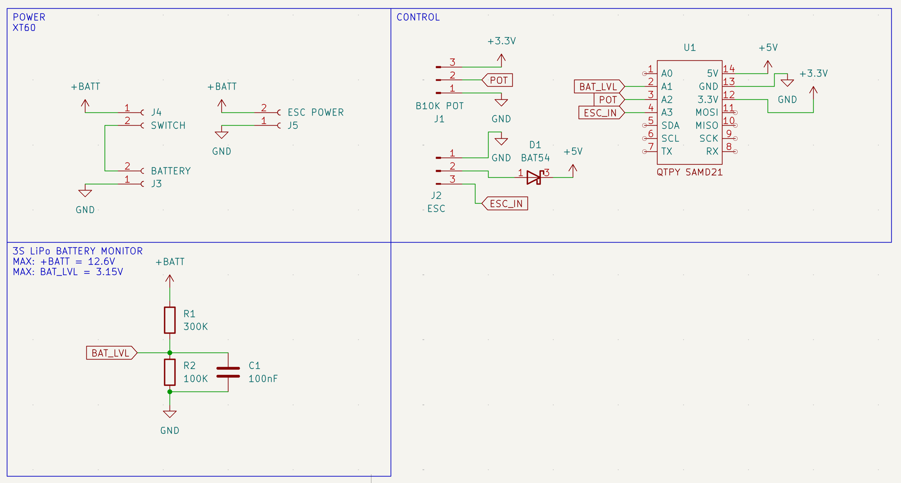

# **Stencil Fix Portable — BoB v.03 - PCB**

A purpose-built **drop‑in PCB** for the **Stencil Fix Portable** vacuum stencil holder. This board replaces the original perfboard wiring with a compact, repeatable assembly, eliminating soldering any wires using common connectors using an **Adafruit QtPy SAMD21 (QtPy M0)**, a **B10K potentiometer** for vacuum control, a **128×32 SSD1306 OLED** for status, and a **30A ESC** driving an **A2212 BLDC motor**. The CAD files in this repository are updated to fit these changes. You can still use this with the original Stencil Fix Portable design and components, you may need to adjust the range of motor control (µs), arming procedure, without the OLED. The PCB outline is 80mm x 20mm, matching common perfboard layout and mounting.



This project is intended to be used with the original Stencil Fix Portable mechanical design and overall concept from the upstream project: [**Stencil Fix Portable** by scheffield](https://github.com/scheffield/stencil-fix-portable). Our updates reflect using more commonly sourced hardware, simplifying the build, and lower cost components. See BOM for updated components and design decisions.

---

## **Highlights / Features**

- **Drop-in replacement PCB** for the Stencil Fix Portable electronics
- **Cooperative Multitasking** providing simple scheduler and tasks using [TaskScheduler](https://github.com/arkhipenko/TaskScheduler)
- [**QtPy SAMD21** microcontroller](https://github.com/adafruit/Adafruit-QT-Py-PCB/blob/master/README.md)
- **Vacuum control** via 10K potentiometer → mapped to ESC PWM (servo µs)
- **5V input from ESC**: 
-  - No need for buck-boost
-  - BAT54 Diode protection
- **OLED UI (128×32 SSD1306)**:
  - Vacuum % bar
  - Battery % bar (with low/critical blinking label)
  - Fan state (ON/OFF)
  - Auto **screen dim after 30 seconds** inactivity
- **Battery SoC estimation** via voltage divider (scaled for **3S LiPo**)
- **Input smoothing** using a one-pole low-pass filter (reduces “twitchy” response)
- **Onboard NeoPixel UX**:
  - Arming/breathing animation
  - Hue reflects potentiometer
  - Low-battery dimming
  - Critical-battery blink
- **XT60 Connectors** standardized connections for RC batteries and ESCs, reduce connector/wiring inside
- **Power Switch** simplified through screw terminals
- **80x20mm Outline**  with 3.2mm Mounting Holes to fit multiple screw types and heat set threaded inserts and drop-in to original design

---

## **Hardware Overview**

 

### **PCB Components**
- MCU: [Adafruit QtPy SAMD21 (QtPy M0)](https://www.adafruit.com/qtpy)
- Battery sense & filtering
  - R1: [300kΩ 0805 Resistor](https://a.co/d/0bcWREO8)
  - R2: [100kΩ 0805 Resistor](https://a.co/d/0bcWREO8)
  - C1: [100nF 0805 Capacitor](https://a.co/d/0i44cuZE)
- Protection
  - D1: [BAT54 Schottky Diode SOT-23-3](https://a.co/d/0dFgMzRd)
- Connectors
  - J5, ESC Power: [XT60 Male](https://a.co/d/0fRPskBY)
  - J2, ESC UBEC: [2.54mm Male Right Angle](https://a.co/d/08ONmiCH) - 3 pin
  - J3, Battery: [XT60 Female](https://a.co/d/0fRPskBY)
  - J4, Power Switch: [5.08mm Screw Terminal Block](https://a.co/d/0d4A6ITm) - 2 pin
  - J1, Potentiometer: [2.54mm Male Right Angle](https://a.co/d/08ONmiCH) - 3 pin
  - U1, MCU Header: [2.54 Male Straight](https://a.co/d/08ONmiCH) - 3 pin (2x)
    
### **External Hardware**
- Control: [B10K (10KΩ) Linear Potentiometer](https://a.co/d/0iVrtQ9j)
- Motor: [A2212 1400kV BLDC Motor](https://a.co/d/0cnJZqye)
- ESC: [30A ESC with 5V BEC](https://a.co/d/0eS2Lal8)
- Battery: [3S LiPo (nominal 11.1V, max 12.6V)](https://a.co/d/00FffIhA)
- Switch: [SPST - 19.2mm x 12.7mm](https://a.co/d/03Vc4zIX)
- Display: 128×32 SSD1306 I2C OLED (0x3C): [OLED Only (Solder or add backpack)](https://a.co/d/053kOUIJ) OR [Adafruit 4440 (Stemma QT)](https://www.adafruit.com/product/4440)
- Wire (better for switch): [18AWG Silicone Wire](https://a.co/d/00WXGGEn)
- Qwiic/Stemma QT Cable (for display): [200mm Stemma QT Cable](https://www.adafruit.com/product/4401) OR [150mm Stemma QT w/ Headers Cable](https://www.adafruit.com/product/4209)

### **Charging**
- Extension cable: [200mm JST-XH Balance Plug Extension](https://a.co/d/07cr4UUC)
- LiPo Charger: [B3 Balance Charger - 3S XH3P Plug](https://a.co/d/02X7mcL8)

## **Electrical Design Notes**

### **Schematic**


### **3S LiPo Battery Monitor/Filter (safe for 3.3V ADC)**

**R1** = 300kΩ, **R2** = 100kΩ
```text
R2 / (R1 + R2) = 100kΩ / 400kΩ = 0.25
```

So at 12.6V max, ADC max voltage:
```text
12.6V × 0.25 = 3.15V
```

**C1** = 100nF (from BAT_LVL to GND as simple RC filter)

### **ESC 5V Protection (Schottky diode)**
**D1** = BAT54 Schottky diode on the ESC’s 5V UBEC rail - used to prevent reverse-current/back-powering conditions between supplies. Expect a small forward voltage drop, typically a few hundred mV depending on load.

### **Connectors / Wiring**.

**J3** — BATTERY (XT60, female on PCB) - Connect your 3S LiPo here

**J5** — ESC POWER (XT60, male on PCB) - Connect your ESC power input here

**J4** — SWITCH (2-pin terminal block) - Inline with the battery positive path (rocker switch pigtails)

**J2** — ESC (3-pin):
- ESC_IN PWM signal to ESC (servo µs)
- +5V from ESC UBEC (through diode to board +5V rail)
- GND

**J1** — B10K POT (3-pin, GVS)
- 3.3V
- POT, wiper input
- GND

**I2C OLED**
- SDA / SCL from the QtPy Stemma QT Connector
- Address: 0x3C
- Power: 3.3V

### **SAMD21 Pin Mapping**

| **Pin**  | **MCU Function**        | **Schematic** | **Notes**                                             |
|------|---------------------|-----------|---------------------------------------------------|
| A1   | Battery Level Input | BAT_LVL   | 3.15V Max Voltage Divider for Battery SoC         |
| A2   | Potentiometer Input | POT       | 12-bit ADC Potentiometer Scaled Input for Control |
| A3   | PWM Signal Output   | ESC_IN    | PWM Output for ESC Control                        |
| 5V   | 5V Power In         | +5V       | 5V Power Input from Schottky Diode/ESC UBEC       |
| GND  | Ground              | GND       | Common Ground                                     |
| 3.3V | 3.3V Power Out      | +3.3V     | 3.3V Power Output for Potentiometer and OLED      |

Uses PIN_NEOPIXEL [(built-in QtPy NeoPixel support)](https://learn.adafruit.com/adafruit-qt-py/neopixel-blink)

## **Firmware Notes**
**ESC arming**

On boot, ESC is held at 1000 µs for 2 seconds, then control is enabled. While not armed, NeoPixel shows an amber “breathing” animation.

**Pot → PWM mapping**

ADC reads at 12-bit (0..4095), Mapped to 1100..1400 µs (then low-pass filtered), If filtered value < 1110 µs, output floors to 1000 µs (fan off), Vacuum % shown as: 1100..1400 µs → 0..100%

**Display**

Vac bar with % (top row), Bat bar with % (second row, “Bat” blinks at low/critical), Bottom row: Fan: ON/OFF, Screen dims after 30 seconds of inactivity and wakes on pot movement or fan state change.

**Battery**

Battery SoC % computed and smoothed with moving averages:
```text
vmin = 9.0V
vmax = 12.6V
```

### **Arduino Libraries**
**Community**:
- [TaskScheduler](https://github.com/arkhipenko/TaskScheduler)
- [Adafruit_NeoPixel](https://github.com/adafruit/Adafruit_NeoPixel)
- [Servo](https://github.com/arduino-libraries/Servo)
- [Adafruit_GFX](https://github.com/adafruit/Adafruit-GFX-Library)
- [Adafruit_SSD1306](https://github.com/adafruit/Adafruit_SSD1306)
- [movingAvg](https://github.com/JChristensen/movingAvg/tree/master)

**Included**:
- lib/BatteryMeter.h [adapted from ESP Battery Shield](https://github.com/inf0matics/esp-battery-shield/tree/main/lib/BatteryMeter)

### **Attribution / Inspiration**

Stencil Fix Portable upstream project by scheffield (mechanical + concept reference). [Stencil Fix Portable](https://github.com/scheffield/stencil-fix-portable)

Battery meter approach referenced from ESP-Battery-Shield by inf0matics (voltage divider / ADC math concept). [ESP Battery Shield](https://github.com/inf0matics/esp-battery-shield/tree/main/lib/BatteryMeter)

**License:** [GNU General Public License v3.0](https://www.gnu.org/licenses/gpl-3.0.en.html)
